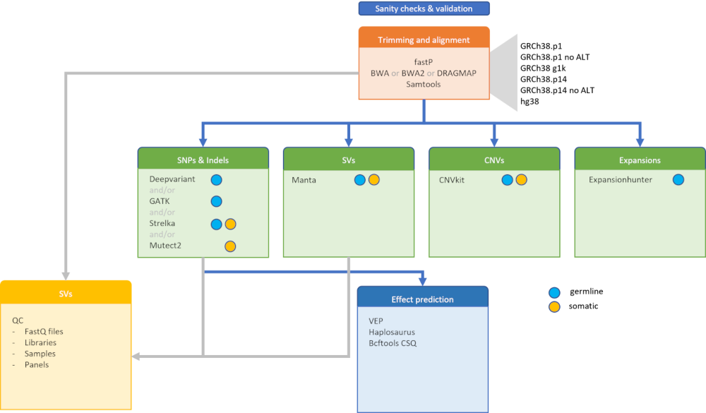

# What happens in this pipeline

This pipeline performs one or multiple competing variant calling tool chains - defined through the command line option `--tools`. 

All toolchains share a basic preprocessing of short reads into alignment files in BAM format. Further pre-processing may be performed depending on the requirements of the downstream tools. 

